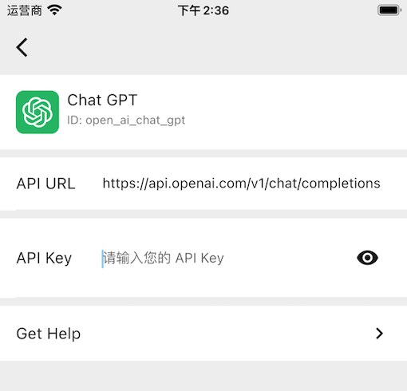

# ChatGPT
ChatGPT，是一个由 OpenAI 训练的大型语言模型。能够处理自然语言文本，并使用深度学习技术生成有意义的回复。被训练用于各种任务，如文本生成、问答、对话、翻译等，能够与人类进行交互，并尽可能准确地理解和回答问题。

训练过程中使用的是一种称为 Transformer 的神经网络架构，它是自然语言处理领域最先进的技术之一。使用的是预训练技术，这意味着 ChatGPT 在许多不同的文本数据集上进行了训练，以便能够理解并回答来自各种领域的问题。

虽然 ChatGPT 不能像人类一样具有情感和直觉，但可以尝试回答各种的问题，并尽可能准确地理解您的意图。

# API Key

OpenAI 提供了 API 用于使用 ChatGPT 的相关功能。API 需要使用 API Key 进行身份验证，小答集成了 OpenAI 所提供的 ChatGPT 相关功能，您只需要在 ChatGPT 服务主页填写您的 API Key 就可以使用 ChatGPT 的所有功能。

1. 访问 [API Keys](https://platform.openai.com/account/api-keys) 获取页面
2. 点击 `+ Create new secret key` 按钮，生成新的 API Key
3. **请将此密钥保存在安全且可访问的地方，密钥不会展示第二次**
4. 打开小答，进入 ChatGPT 服务主页，如下图：
   
5. 点击键盘上的 `done` 完成设置

完成上面的步骤，回到主页，就可以和 ChatGPT 进行交流了。